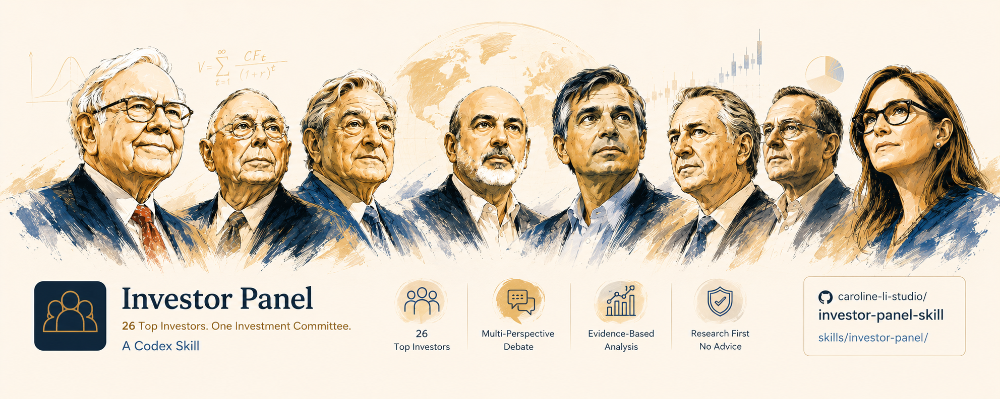
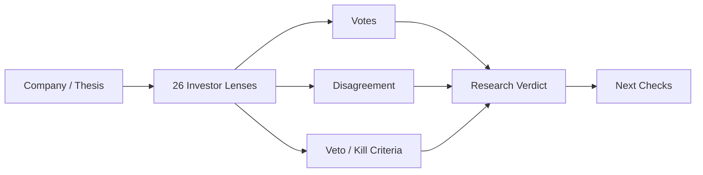

# Investor Panel

> 让一家公司接受 26 位顶级投资者框架的共同审视。  
> 不是一个 AI 分析师给答案，而是一场投资委员会辩论。



Investor Panel 是一个 Codex Skill。你把公司、股票、持仓或投资 thesis 交给它，它会让不同投资风格一起上桌：Buffett 看质量和护城河，Graham / Klarman 看安全边际，Damodaran 把故事翻译成数字，Taleb 找尾部风险，Druckenmiller / Soros 看宏观与流动性，Simons 追问统计证据，Serenity 拆供应链瓶颈。

真正的卖点不是“多一个结论”，而是**看到高手之间为什么不同意**：好公司是不是太贵？增长是不是被高估？便宜是不是价值陷阱？故事是不是没有证据？最大风险是不是足以一票否决？

## 一句话安装

最简单的方式是把仓库链接交给 Codex，并让它安装完整技能目录：

```text
请从这个仓库安装 Codex skills：
https://github.com/caroline-li-studio/investor-panel-skill.git

请把 skills/ 下的完整技能文件夹安装到我的 Codex skills 目录中。
不要只复制 SKILL.md。
```

## 你会得到什么

- **投资者投票**：每个 lens 给出 signal、confidence 和核心理由。
- **共识与分歧**：哪些判断大家同意，哪些地方发生真正冲突。
- **反方挑战**：从估值、周期、财务、治理、技术、尾部风险上攻击 thesis。
- **否决条件**：什么事实出现时，这个投资逻辑应该被推翻。
- **下一步核查**：应该继续看哪些 filings、指标、新闻、行业证据或供应链线索。

## Panel 怎么辩论



## 默认投资委员会

| 视角 | 代表 lens |
| --- | --- |
| 质量与长期复利 | Warren Buffett, Charlie Munger, Phil Fisher, Nick Sleep, Terry Smith, Li Lu |
| 价值与安全边际 | Benjamin Graham, Seth Klarman, Joel Greenblatt, Mohnish Pabrai, John Templeton |
| 估值与数字纪律 | Aswath Damodaran, Valuation, Fundamentals |
| 宏观、周期与风险 | Stanley Druckenmiller, George Soros, Howard Marks, David Tepper, Nassim Taleb |
| 特殊情境与反共识 | Jim Simons, Michael Burry, Bill Ackman, Cathie Wood, David Swensen, Julian Robertson, Rakesh Jhunjhunwala |
| 主题与供应链 | Serenity-style supply-chain research |

每个投资者都有独立的深度蒸馏档案，包含来源骨架、核心心智模型、操作规则、证据要求、否决条件和盲区。

## 适合问什么

```text
用 Investor Panel 分析 NVDA：这家公司现在到底是伟大生意、估值泡沫，还是两者都是？
```

```text
让 Buffett、Munger、Damodaran、Taleb 和 Simons 一起看这家公司，告诉我他们会在哪里分歧。
```

```text
用 Investor Panel 比较 AAPL、MSFT、NVDA、TSLA，按“最值得继续研究”排序。
```

```text
用 Investor Panel 挑战这个 thesis：
这家公司控制了 AI 数据中心电力供应链里的稀缺瓶颈。
```

```text
用 Investor Panel 做 hold/sell review：我持有这家公司，什么事实出现时我应该重新评估？
```

## 输出长什么样

一次完整分析会输出：

- `Verdict`：buy / watch / pass / hold / sell-risk 等研究框架下的结论。
- `Investor Votes`：每个 lens 的 signal、confidence、core reason。
- `Consensus`：panel 一致同意的地方。
- `Disagreement`：投资者 lens 之间真正分歧的地方。
- `Key Assumptions`：3-5 个可以被证伪的关键假设。
- `Evidence Gaps`：缺哪些数据才可以提高置信度。
- `Risks & Kill Criteria`：什么事实会打破 thesis。
- `Next Checks`：下一步该验证什么。

## 目录结构

```text
skills/investor-panel/
├── SKILL.md
├── agents/
│   └── openai.yaml
└── references/
    ├── evidence-pack.md
    ├── investor-lenses.md
    ├── lens-creation.md
    ├── people-index.md
    ├── output-contract.md
    └── people/
        └── 26 个深度蒸馏投资者档案
```

## 边界

- 只做研究辅助，不是投资建议。
- 不保证收益，不生成交易订单。
- 不编造当前股价、财务数据、filing、客户、合同、持仓或市值。
- 涉及“现在、最新、今天、最近”的事实，必须先用可用工具验证。
- 数据收集系统会作为另一个项目单独建设。

## English

English version: [README.en.md](README.en.md)
