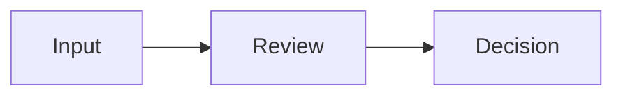

# README Patterns

Use these patterns to make a GitHub homepage understandable and promotable.

## Three-Second Test

The top of the README should answer:

- What is it?
- Who is it for?
- Why is it different?

If the reader must scroll to understand the value, the page is too slow.

## Strong Opening Formula

```markdown
# Project Name

> One clear promise. No jargon unless the audience expects it.


One short paragraph: who uses it, what problem it solves, and what makes it distinct.
```

## Feature Copy

Write benefits before mechanics:

- Weak: "Uses YAML references and modular prompt routing."
- Strong: "Turns a messy idea into a repeatable review process."

Use feature bullets like:

- **Outcome**: what the user gets.
- **Mechanism**: how the project achieves it.
- **Boundary**: what it deliberately avoids.

## Install / Try Path

Make the first try path short. A README may contain advanced installation later, but the first path should be one of:

- one shell command
- one Codex prompt
- one copied URL
- one minimal example

## Mermaid Diagrams

Use Mermaid for mental models, not decoration.

Good:



Avoid huge diagrams with too many nodes. GitHub README diagrams should make the project easier to understand at a glance.

## Anti-Patterns

- Starting with implementation details.
- Saying "powerful" without showing what power means.
- Long setup before the user knows the value.
- Too many badges.
- A feature list that could describe any repo.
- Screenshots that show internals instead of user value.
- Unverified performance claims.
- Over-formal corporate tone for a small open-source project.
